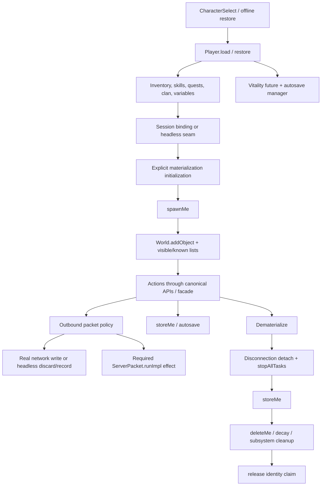

# DEPENDENCY MAP — Task 001

Evidence is for commit `16d61833b3983a3976583d0e4813e0de9457a52f`.

## Lifecycle graph



## Existing and proposed states

| Existing connected state | Evidence | Headless equivalent |
|---|---|---|
| client authenticated | `GameClient.ConnectionState` | identity lease acquired |
| character loaded | `CharacterSelect`, `GameClient.load`, `Player.load` | `LOADED` |
| bidirectional bind | `CharacterSelect:211-213` | attach headless session/output seam |
| entering | `ConnectionState.ENTERING` | `MATERIALIZING` |
| spawned/entered | `EnterWorld:456`, `:790` | `ACTIVE` after explicit domain steps |
| disconnect | `GameClient.onDisconnection` | stop admission/actions |
| detach/store/delete | `Disconnection`, `Player.deleteMe` | `DEMATERIALIZING -> STORED` |

## Client-coupling matrix

| Coupling | Canonical evidence | Headless rule |
|---|---|---|
| Pure outbound packet | `Player.sendPacket` | validate non-null; discard/record without bytes |
| Packet with effect | four `runImpl` families | execute effect exactly once before discard |
| Broadcast | `Player.broadcastPacket`, `World.addVisibleObject` | preserve delivery to real observers |
| Session/account | `GameClient`, LoginServer trace/logout, HWID | exclude from headless actor; explicit identity policy |
| Flood protection | request handlers use `getClient().getFloodProtectors()` | facade supplies server-side rate/budget policy |
| Domain mutation in handler | trade, commerce, mail, skills, respawn | facade invokes canonical lower-level operations with same validation |
| Direct null-sensitive code | BotReport/VillageMaster/AntiFeed and handlers | action-specific gate; no global null-safety claim |

## Gameplay subsystem matrix

Readiness values are `REUSE_DIRECT`, `REUSE_WITH_ADAPTER`,
`NEEDS_SERVER_FACADE`, and `UNSAFE/UNKNOWN`.

| Subsystem | Canonical objects and server APIs | Client coupling | Persistence / transaction / cleanup / concurrency | Future seam and test gate | Readiness |
|---|---|---|---|---|---|
| Party | `Party`, `Player.joinParty/leaveParty`, `Party.addPartyMember/removePartyMember/broadcast*` (`Party.java:281-531`, `Player.java:6832-6850`) | invite/accept/oust policy is in `RequestJoinParty`, `RequestAnswerJoinParty`, `RequestOustPartyMember` | primarily in-memory; synchronized/group operations; `deleteMe` leaves party; offline play reconstructs parties | `PhantomActionFacade.party*`; test invite/accept/leave and rollback of partial membership | `NEEDS_SERVER_FACADE` |
| Command channel | `CommandChannel.addParty/removeParty/disbandChannel` (`CommandChannel.java:63-121`) | request handlers establish leadership/invites | in-memory; party owns link; disband/remove on party lifecycle | facade around party/channel eligibility; test leader removal and dematerialization | `REUSE_WITH_ADAPTER` |
| Clan/alliance/war | `Clan`, `ClanTable`, `Player.setClan`, clan broadcasts | many creation/invite/war handlers are client-driven | `clan_data`, `clan_privs`, `clan_skills`, `clan_subpledges`, `clan_wars`; clan member pointer cleared in `deleteMe` | facade for join/create/war; test member online pointer, privileges and restart | `NEEDS_SERVER_FACADE` |
| Direct trade | `Player.startTrade/cancelActiveTrade`, `TradeList.confirm/validate/transferItems` (`Player.java:6142-6192`, `TradeList.java:404-624`) | `AnswerTradeRequest`/`TradeDone` contain request policy | ordered nested locks and synchronized lists; inventory transfer; no single DB transaction; `deleteMe` cancels request/trade | facade owns state machine and timeout; test simultaneous confirm, disconnect and conservation | `NEEDS_SERVER_FACADE` |
| Private sell/buy/manufacture | `TradeList.privateStoreBuy/privateStoreSell`, player sell/buy/manufacture lists, `PrivateStoreType` | `SetPrivateStore*`, `RequestPrivateStoreBuy/Sell` validate/flood-check and close store | inventory locks plus offline trade rows; realtime autocommit replacement; restore/cleanup in `OfflineTraderTable` | facade for publish/purchase/close; test oversell, crash between item and metadata, restart | `NEEDS_SERVER_FACADE` |
| NPC buy/sell/multisell | `BuyListData`, `MultisellData`, `Player.reduceAdena`, `PlayerInventory.add/destroy/transfer` | core pricing/capacity/fee logic sits in `RequestBuyItem`, `RequestSellItem`, `MultiSellChoose` | item DB persistence is separate; multisell performs multi-step consumption/creation | dedicated commerce facade reusing extracted validators; conservation/overflow/partial-failure test | `NEEDS_SERVER_FACADE` |
| Inventory/item transfer/reservation | `PlayerInventory`, `Inventory`, `Item`, `ItemContainer.transferItem`; player add/destroy/transfer wrappers | packets initiate operations but canonical mutations are server-side | `items` plus item attributes/elementals/variables; item/container synchronization; no general reservation primitive | direct APIs behind facade; Task 004 basic item check, later reservation ledger and anti-dup failure injection | `REUSE_WITH_ADAPTER` |
| Mail | `MailManager.sendMessage`, `Message`, attachment request handlers | `RequestSendPost` combines recipient/access/fee/attachment validation and mutation | `messages` plus item ownership; several DB writes, no observed encompassing DB transaction; expiration manager owns cleanup | mail facade/escrow; test attachment ownership conservation and duplicate retry | `NEEDS_SERVER_FACADE` |
| Quest/timers | `Quest`, `QuestState`, `QuestTimer`; `Quest.playerEnter`, give/take item helpers | NPC/packet events select actions; core state is server-side | `character_quests`; per-player quest timer list synchronized and canceled by `stopAllTasks`; scripts may schedule their own timers | whitelist adapter only; Task 004 assert timers clean, later quest-specific deterministic tests | `REUSE_WITH_ADAPTER` |
| Instance | `Instance`, `InstanceManager`, `WorldObject.setInstanceId` | enter packets/scripts often choose instance | `character_instance_time`; instance membership set; `deleteMe` removes when restoration disabled | lifecycle service reconciles membership before spawn and on cleanup; test failed enter and restart | `REUSE_WITH_ADAPTER` |
| PvP/PK/karma/drop | `Player` relation/karma/PvP methods, `PlayerStatus`, PvP/attack stance managers | attack request validates target/session; combat core is actor/skill based | character counters/karma/items; shared task managers; death cleanup and item drop are multi-step | combat facade with canonical checks; test flag/karma/drop invariants and cancellation | `NEEDS_SERVER_FACADE` |
| Death/resurrection | `Creature.doDie`, `Player.doDie`, `Player.doRevive`, teleport APIs | `RequestRestartPoint` contains respawn destination/eligibility logic | HP/location/penalties/items; timers and instance/siege rules; logout-on-death options | respawn facade; Task 004 only safe action, later death/restart failure matrix | `NEEDS_SERVER_FACADE` |
| Siege/fort/territory war | `Siege`, `SiegeManager`, `FortSiegeManager`, `TerritoryWarManager`, residence objects | registration/control handlers are client-driven | `siege_clans`, `fortsiege_clans`, clanhall attacker tables; managers and scheduled siege lifecycle; `deleteMe` drops flags | event-specific adapters; test registration, flag cleanup, shutdown/restart | `REUSE_WITH_ADAPTER` |
| Raid/epic | NPC/raid AI, `GrandBossManager`, boss zones and status tables | targeting/party action requests are client-driven | boss state/zone managers; spawn/AI timers; party/command channel membership | planner uses combat/party facades, never boss DB directly; controlled raid fixture gate | `REUSE_WITH_ADAPTER` |
| Chat/PM/trade chat | `ChatHandler`, `IChatHandler`, `CreatureSay`, block/friend/snoop state | `Say2` performs channel/access/flood routing | mostly in-memory plus block/friend/contact tables; packet effect broadcasts snoop | chat facade with channel policy/cooldown; test PM target, observer, block and snoop effect | `NEEDS_SERVER_FACADE` |
| Skills/shots/autouse/autoplay | `Player.useMagic`, `Skill`, inventory item APIs, `AutoUseTaskManager`, `AutoPlayTaskManager` | `RequestMagicSkillUse` and `UseItem` contain selection/flood/session checks | skills/reuse tables, consumable items; pooled shared recurring tasks plus some player futures | action facade calls validated server methods; test reuse, resource consumption and pooled cancellation | `NEEDS_SERVER_FACADE` |
| Teleport/navigation/geodata | `Creature.moveToLocation`, AI intentions, `WorldObject.teleToLocation`, `GeoEngine` | move/validate/teleport request handlers include client coordinates/policy | player coordinates in `characters`; world/region locks and teleport watchdog; geodata files absent | navigation service over canonical move/teleport APIs; Task 004 no-geodata graceful gate | `REUSE_WITH_ADAPTER` |
| Global ThreadPool/task managers | `ThreadPool`, autosave/PvP/attack/auto-use/autoplay managers | no required client except tasks that call client-sensitive actions | shared executors/concurrent maps; `stopAllTasks`, `deleteMe`, manager remove methods own cancellation | shared bounded Phantom scheduler; test no per-phantom executor/future growth and shutdown admission stop | `REUSE_DIRECT` |

## Persistence and transaction map

```text
Player.load/store
  -> characters
  -> items + item_attributes/item_elementals/item_variables
  -> character_skills / shortcuts / quests / variables / subclasses
  -> warehouse/freight item ownership

OfflinePlayTable
  -> character_offline_play
  -> character_offline_play_group
  -> multiple delete/insert statements under autocommit

OfflineTraderTable
  -> character_offline_trade
  -> character_offline_trade_items
  -> inventory/private-store state, persisted separately

Clan/siege/instance
  -> clan_* / clan_wars
  -> siege_clans / fortsiege_clans / clanhall attacker tables
  -> character_instance_time

Mail/trade
  -> messages + item owner/location changes
  -> synchronization protects live transfer, but no general crash transaction
```

Required future boundary: domain mutation owns validation and in-memory locks;
repository transaction/ledger owns durable multi-resource commit and recovery.
Phantom code must not write these tables directly.

## Thread and task ownership map

| Owner | Work | Cancellation/cleanup | Audit risk |
|---|---|---|---|
| `Player` constructor | vitality recurring future | `stopAllTasks` | starts during load, before materialization succeeds |
| `Player` | UI/status/item/skill delayed futures, fishing/fame/water/etc. | mixed explicit cancels plus `stopAllTimers` | not every short future is visibly covered by `stopAllTasks` |
| `PlayerAutoSaveTaskManager` | one shared 1-second scan | `remove(player)` in `deleteMe` | load registers before spawn |
| auto-use/autoplay managers | one task per fixed-size pool | remove player; pool lifecycle | pooled pattern is reusable; empty-pool task lifetime needs measurement |
| PvP/attack stance managers | shared fixed-rate scans | manager remove/expiry | must clean phantom references |
| quest scripts | `QuestTimer` and arbitrary scheduled work | player timer lists and script cancellation | whitelist only until cancellation is proven |
| Fake player chat | one random delayed task per reply | no returned owner/cancel handle | explicitly rejected pattern |
| future Phantom scheduler | bounded shared queues | lifecycle-owned cancellation token | no per-phantom thread/executor/task loop |

## Failure and rollback points

| Failure point | Existing residue risk | Required rollback assertion |
|---|---|---|
| during `Player.load` | object, vitality task, partial restored containers | no autosave/task/world/online residue |
| after load, before spawn | online memory flag and autosave membership | `Disconnection`/bounded cleanup restores `STORED` |
| `World.addObject` duplicate | current behavior disconnects both | identity claim prevents normal collision; no duplicate object ID |
| partial enter initialization | clan/quest/instance/effects partially active | reverse registered steps in bounded order |
| action while dematerializing | inventory/trade/party race | action admission closed before cleanup |
| partial store | divergent tables/items/status | error surfaced; retry/idempotency/reconciliation, never silent success |
| shutdown | new decisions racing store | scheduler stops admission, drains/cancels, then lifecycle stores |
| real login collision | phantom and client contend for identity | deterministic reject or bounded handoff, never dual ownership |

## Task 004 exact validation surface

The feasibility spike must instrument/assert:

1. a single identity claim and `World` object ID;
2. constructor/autosave/task counts before/after;
3. explicit materialization steps instead of `EnterWorld.runImpl`;
4. outbound sink null rejection, bounded recording and no socket write;
5. exactly-once `ServerPacket.runImpl` for HTML and chained packets;
6. visibility broadcast to a real/recording observer;
7. inventory/skills restored and one safe server action;
8. `Disconnection` plus idempotent second cleanup;
9. online/world/party/trade/request/instance/task absence after cleanup;
10. store and restart recovery in `l2jmobiush5_phantom_test`.
